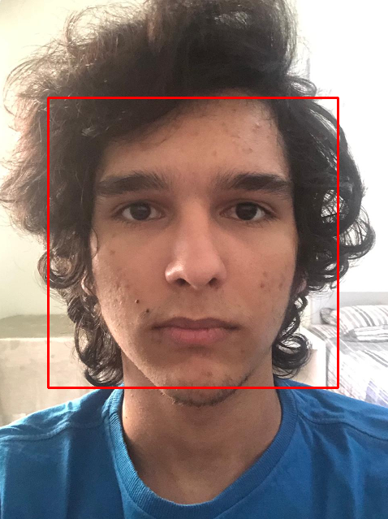

<h1 align="center">
    Mask Finder
</h1>
<p align="center">
    Simple implementation of the Haar Cascade Algorithm
</p>

## How to use?
```python
python3 src/findmask.py path="/path/to/image"
```

## How does it work?
In a nutshell, this code tries to identify if there is a person face in the image and if their mouth is covered.

## Some Examples
| Input               |  Output             |
| ------------------- | ------------------- |
|   |   |
|   |   |
|   |   |